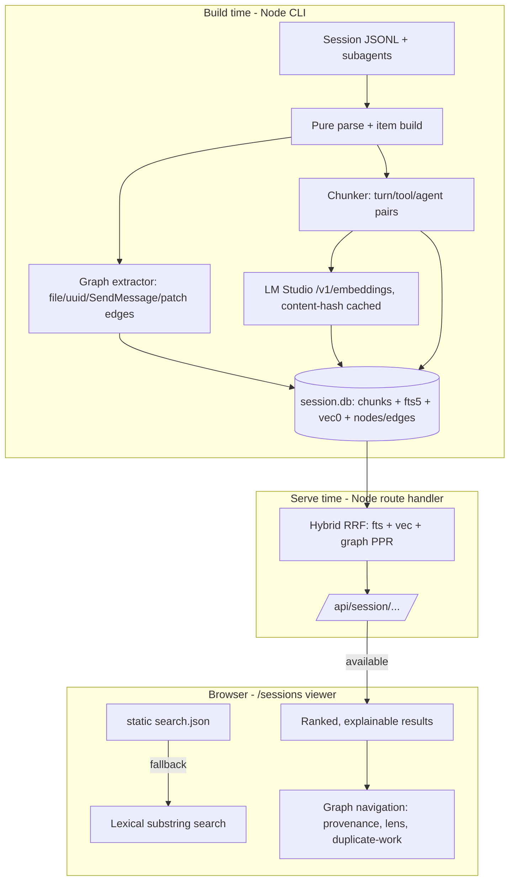
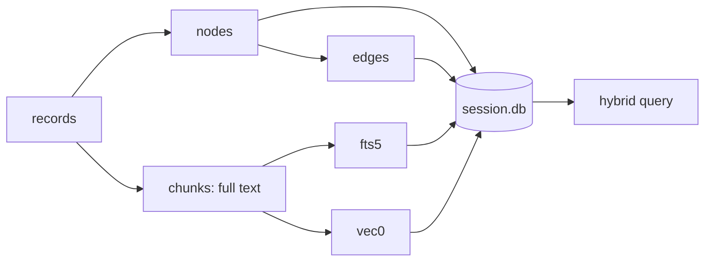
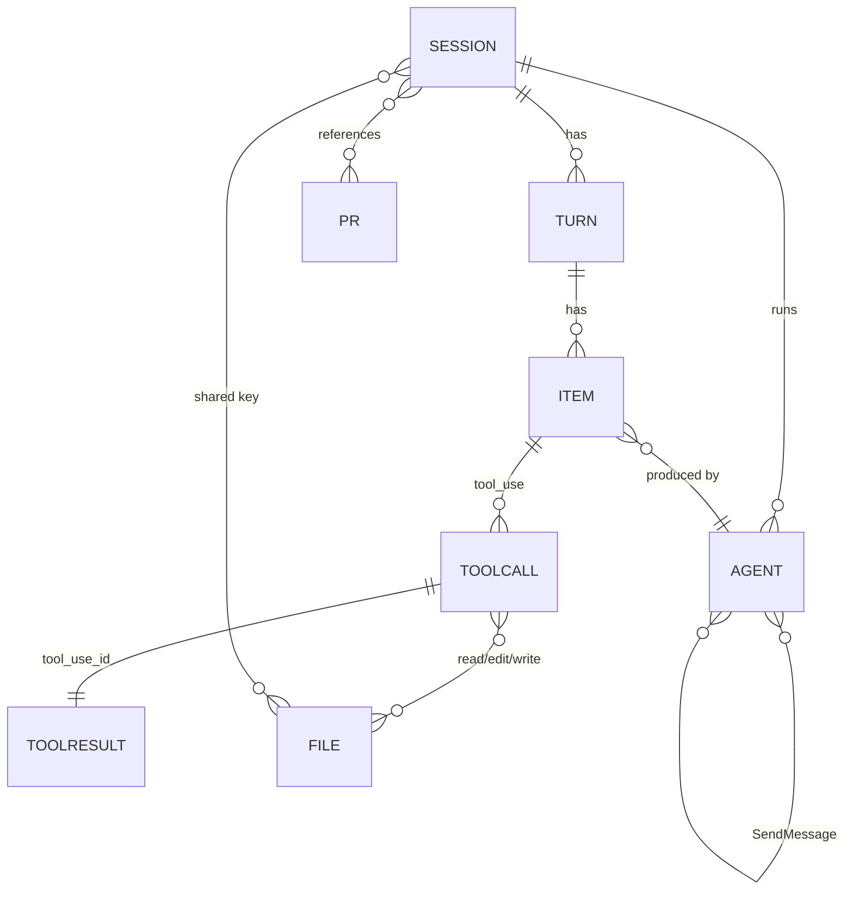

# Session Database with Hybrid Search and Knowledge Graph - Plan

## Goal Capsule

- **Objective:** A user can find and navigate what happened across their Claude Code sessions by meaning and by structure — full transcript text and subagent work become searchable, and the relationships between turns, tool calls, files, agents, and other sessions are traversable — from the existing `/sessions` viewer.
- **Means:** One SQLite file holding full text, an FTS5 index, `sqlite-vec` embeddings, and a nodes/edges graph, built by a content-addressed incremental ingest, queried by a local Node retrieval service, and surfaced in the viewer (KTD1, KTD2).
- **Authority:** The Product Contract governs behavior; the Key Technical Decisions govern mechanism. A unit overrides neither.
- **Execution profile:** Phased code work; schema and ingest land before retrieval, which lands before viewer UX.
- **Stop conditions:** Stop and re-scope if keeping the static/hosted demo working requires abandoning the local-DB design, or if graph traversal requires a separate daemon (a dedicated graph engine was explicitly rejected).
- **Finishes and ships:** `ce-work`.

---

## Product Contract

### Summary

Add a session database to `claude-JSONL-browser`: a single SQLite file that stores the full untruncated transcript text, embeddings for hybrid search, and a session knowledge graph, fed by a content-addressed incremental ingest and surfaced through graph-expanded hybrid retrieval and graph-aware navigation in the `/sessions` viewer. The static/hosted experience keeps working by degrading to lexical search when the local database or LM Studio is unavailable.

### Problem Frame

The current index is a per-session set of static JSON files: `search.json` is a flat, truncated document list scanned client-side with `String.includes` and capped at 300 results in document order, and the 114 MB of subagent bodies never enter the search corpus beyond a ≤2000-char summary. A user who remembers *that* something happened, or that a file was edited, or that another session touched the same problem, has no way to find it: search is per-session, unranked, coverage-incomplete, and structure-blind. The ideation (`docs/ideation/2026-10-09-session-graph-and-hybrid-search-ideation.html`) established that the fix is a real store — hybrid lexical+vector retrieval over full text, plus a graph that makes the relationships the transcript already encodes first-class.

### Requirements

**Storage and ingest**

- R1. One SQLite database file stores the full untruncated text of every turn item and subagent item, together with an FTS5 full-text index, `sqlite-vec` embeddings, and the session graph.
- R2. Ingest is content-addressed and incremental: unchanged documents are not re-embedded, re-indexing a grown session writes only new or changed rows, and readers never observe a torn transaction (a full rebuild swaps the file atomically).
- R3. Embeddings are generated locally through LM Studio; when LM Studio is unavailable, ingest still completes with full-text search available, embeddings recorded as partial, and a later run backfills them.
- R4. A schema version gates compatibility: an index built by an incompatible version is rejected with a clear "rebuild required" signal rather than rendered with missing fields.

**Graph**

- R5. The graph captures typed nodes and edges derived from the transcript: session, turn, item, agent, tool-call↔result pair, PR, and file nodes; agent→parent, item→agent, `tool_use`↔`tool_result`, turn→item, session→agent, session→PR, tool→file, and agent-coordination edges (SendMessage, background task).
- R6. Cross-session edges connect sessions through shared keys — file path, git branch, PR, and content hash — so one query can find every session that touched the same file or work.

**Retrieval**

- R7. Search is hybrid: an FTS5 lexical leg and a vector leg fused by reciprocal-rank fusion, replacing the 300-in-document-order substring scan, with ranked results that explain why each matched (matched span and source leg).
- R8. Retrieval is graph-expanded: neighbors of the hybrid seeds are traversed and reranked by personalized PageRank, with a bounded traversal depth, a cycle guard, and a relevance floor so expansion boosts but never filters.
- R9. Search can be scoped to the current session or across all sessions, and cross-session results carry their session context.

**Viewer**

- R10. The viewer exposes graph-aware navigation — provenance on every block, a neighborhood lens, a duplicate-work rail, and facet filters over existing metadata (kind, tool, agent type, model, error) — reusing the existing jump, highlight, and hash-deep-link conventions.

**Degradation**

- R11. The static/hosted experience degrades gracefully: with no local database or LM Studio, the viewer falls back to the existing lexical search and still renders every session.

**Integrity and safety**

- R12. The catalog and the database commit together: a database `build_epoch` matches the catalog's, and a mismatch is detected at open rather than pairing a new database with a stale catalog.
- R13. Chunk, FTS5, and vector rows stay aligned: every chunk has exactly one FTS5 row per FTS index and at most one vector row (present iff its embedding is complete), and deletes reconcile across all indexes in the same transaction, so no hit resolves to a missing parent.
- R14. Embedding rows record their model id and dimensions; a partial-to-complete transition never overwrites a complete vector, and a model or dimension change never reuses an incompatible vector.
- R15. Schema migration runs in a single transaction and is DDL-only (cheap at any size); a failed migration leaves the prior version intact and openable, and an integrity check runs on open.
- R16. Ingest is single-writer under a cross-process advisory lock: a concurrent build cannot interleave, and readers tolerate a build swap or in-progress upsert without corruption.
- R17. Removed or renamed sessions are pruned from the store, with their chunk, vector, and graph rows reconciled in the same transaction.
- R18. The local retrieval API enforces a defined security boundary: it fails closed unless bound to loopback, authenticates via a per-run token delivered server-side (httpOnly cookie or server-injected value, never in the client bundle or a URL), validates origin and host, binds all query parameters with an escaped FTS5 term, loads a pinned `sqlite-vec` from a fixed path, and refuses a non-loopback LM Studio endpoint.

### Key Decisions

- KD1. **The store is one SQLite file.** (session-settled: user-directed — chosen over a dedicated embedded graph engine: Kùzu was archived in Oct 2025 and acquired by Apple, making a separate graph engine high-churn risk.) Governs R1, R5.
- KD2. **Embeddings are generated locally via LM Studio.** (session-settled: user-directed — chosen over a hosted embedding API: privacy and offline operation.) Governs R3.
- KD3. **The session knowledge graph is in scope.** (session-settled: user-directed — chosen over search-only: cross-session and structural questions are the point.) Governs R5, R6.
- KD4. **All seven ideation survivors are in scope as one phased program.** (session-settled: user-directed — chosen over a narrower first slice.) Governs R1–R11.

### Scope Boundaries

**Deferred for later**

- LLM-based entity resolution and summarization over the graph (Graphiti/Zep-style communities); phase one links on concrete keys only (R6).
- A materialized transitive closure / all-pairs centrality index; phase one traverses with a depth cap and can add precomputation if a query proves slow.

**Outside this product's identity**

- A separate graph database process or daemon (rejected in KD1).
- Multi-user or hosted-server deployment; this stays a local single-user tool with a degraded static demo.

### Success Criteria

- A natural-language query returns the relevant turn even when the query words never appear in it, ranked above the lexical-only baseline on a hand-checked set of session queries.
- A file-path query returns every session and agent that read or edited that file.
- Re-indexing a session that grew by a handful of turns re-embeds only the new or changed documents and completes in seconds.
- The `/sessions` page still renders and searches when no database and no LM Studio are present.

### Dependencies

- LM Studio running locally with `unsloth/embeddinggemma-2-GGUF` loaded for embeddings (R3); the feature degrades without it.
- Node 24 (already the runtime) for the built-in `node:sqlite` module and FTS5 (KTD5).

---

## Planning Contract

### Key Technical Decisions

- KTD1. **Schema: one SQLite file, one rowid, three concerns.** A `chunks` base table holds the full untruncated text; an FTS5 external-content table and a `vec0` virtual table both key on the same rowid; `nodes`/`edges` tables hold the graph. Hybrid retrieval is a single query joining on rowid. (session-settled: user-approved — chosen over browser-WASM SQLite: the local sidecar supports real FTS5, `sqlite-vec`, and graph traversal with one file.) Rationale: three parallel key spaces and three stores is how hybrid search drifts; one key makes vector, keyword, and graph results trivially joinable.
- KTD2. **Runtime topology: a local Node process owns the database.** Ingest and retrieval run in Node (`next dev`/`next start` or the index CLI); the browser never runs SQLite. Retrieval is exposed to the viewer through an App Router route handler under `app/api/`. Rationale: `node:sqlite` gives FTS5 and `sqlite-vec` natively; a WASM SQLite cannot run the graph leg or load the extension cleanly, and the static demo has no database at all. This supersedes the repo's current "no API routes" constraint, which AGENTS.md must be updated to reflect (U8).
- KTD3. **Embeddings: LM Studio `/v1/embeddings`, content-hash cached.** The embedding model is `embeddinggemma-2` (768-dim, Matryoshka-truncatable, 2K-token context). Each document is keyed by `sha256(normalized_text + model + dims + version)`; only changed keys are sent. Calls are sequential or low-concurrency (LM Studio's concurrent-request handling is unreliable); responses are sorted by `index`; vectors are L2-normalized and stored at 256 dims by default. Query and document text use the model's required role prompts. Rationale: embedding is the slow, flaky part; content-addressing removes most of it and sidesteps the concurrency bugs.
- KTD4. **Chunking: turn-pair / tool-pair / agent-item chunks with a parent pointer.** Embed a cleaned projection (role + tool name + text) at the chunk level; return the parent turn or agent (small-to-big). Oversized items are split into child chunks under a parent pointer, each within the model's token budget. Store the full untruncated text once in `chunks`; the current `searchLimit`/`truncate` behavior is a display concern only. Rationale: item-level fragments lose the request↔response pairing, and embedding tool-output noise dilutes semantics.
- KTD5. **Driver: `node:sqlite`, with `better-sqlite3` as the fallback.** `node:sqlite` on Node 24 ships FTS5 and loads `sqlite-vec` via `new DatabaseSync(path, { allowExtension: true })`. If the extension-loading path proves unstable, fall back to `better-sqlite3` (FTS5 built in, N-API, prebuilt binaries). Either way the DB module stays server-only and out of client bundles. `sqlite-vec` is pre-v1 and pinned exactly; the extension is loaded once from a fixed path after an integrity check, and `allowExtension` is not left as an open gate.
- KTD6. **Graph model: typed `nodes`/`edges` tables, bounded traversal.** `edges(from, to, type, props)` indexed on `(from)`, `(to)`, `(type)`; traversal uses `WITH RECURSIVE … UNION` with an explicit depth cap (≤8) and a visited-set cycle guard. No unbounded recursion, no adjacency search by `LIKE`.
- KTD7. **Fusion: RRF over FTS5 + `vec0` + a graph leg.** Each leg is rank-numbered (`row_number()` over `rank`/`distance`), fused by `SUM(1/(60 + rank))`; the graph leg is personalized-PageRank seeded from the hybrid hits. Raw `bm25()` (negative) and cosine distance are never blended directly. FTS5 uses `unicode61` with a `trigram` companion index for identifier-heavy text.
- KTD8. **Ingest atomicity and versioning.** Incremental runs upsert in WAL transactions; full rebuilds checkpoint to a single file and atomically rename it, writing the catalog last and stamping a matching `build_epoch`. Bump `SESSION_INDEX_VERSION` on any shape change and reject a mismatched index at read time with a rebuild signal; run `PRAGMA integrity_check` on open.
- KTD9. **Degradation.** The client seam in `lib/jsonl/session-index-client.ts` prefers the API when reachable and falls back to today's static `search.json` substring scan otherwise; embeddings-partial sessions still answer via FTS5. Availability is signalled per deploy — the static-host manifest is built with `api:false`, the Node server serves a manifest with `api:true` — and the client still tolerates a failed API call by falling back.
- KTD10. **WAL + single-writer for incremental runs; atomic file swap for full rebuilds.** Incremental upserts run in WAL transactions under a cross-process single-writer advisory lock; a full rebuild checkpoints to `journal_mode=DELETE` (collapsing to one file), runs `PRAGMA integrity_check`, and atomically renames that one file. A live database is never renamed, and build-to-temp is not used for small deltas (that would be O(database size), not O(delta)). Readers never observe a torn transaction.
- KTD11. **Single SQLite file per corpus; cross-session edges live in it.** One database file holds the per-session chunk text and vectors alongside the shared graph, so cross-session edges and within-session retrieval share one rowid space and one transaction (honoring KD1 and R1). Per-session partitioning is a deferred optimization if a single file's size proves unmanageable.
- KTD12. **Two independent versions: schema and embedding.** `SESSION_INDEX_VERSION` gates schema shape; `embedding_model_id` + `dims` + `chunker_version` gate vector reuse, so swapping the model or chunker re-embeds without a schema migration, and a schema bump never silently reuses vectors.

### High-Level Technical Design



Ingest data flow:



Graph schema:



### Output Structure

```text
lib/jsonl/
  session-db.ts            # schema, node/edge extractors, chunker (pure, no relative imports)
  session-db-node.ts       # node:sqlite driver: open, migrate, upsert, query
  session-embed.ts         # LM Studio client + content-hash cache
  session-retrieve.ts      # hybrid RRF + graph traversal/PPR
  session-index-client.ts  # (extended) API-preferred, static fallback
scripts/
  build-session-index.ts   # (extended) writes the DB + JSON artifacts
app/api/session/
  [...path]/route.ts       # search + graph query endpoints
components/jsonl/
  SessionIndexViewer.tsx   # (extended) hybrid search, scope toggle, graph nav
  SessionBlocks.tsx        # (extended) provenance on blocks
```

### Assumptions

- The user runs the app locally via `next dev`/`next start` (Node), not a pure static export, when using the database.
- LM Studio exposes `/v1/embeddings` on `http://localhost:1234`; the port is configurable and loopback-only.
- `embeddinggemma-2` output is not assumed L2-normalized; the pipeline normalizes and re-normalizes after Matryoshka truncation.
- Node is pinned via `engines` to a 24.x line where `node:sqlite` FTS5 and extension loading are available; the app fails fast otherwise.
- Store cardinality is one SQLite file per corpus (KD1, R1); per-session partitioning is a deferred optimization, not the normative design.

### Sequencing

U9 (feasibility spike) → U1 → U2 → U3 → U4 → U5 → U6 → U7, with U8 (docs/config) landing alongside U6 only. U1 depends on U9; U3 depends on U1; U5 depends on U4; U7 depends on U5 and U6.

### System-Wide Impact

- **New server surface:** `app/api/session/[...path]/route.ts` is the first route in a previously route-free app. The repo's "no API routes" constraint (AGENTS.md/CLAUDE.md) becomes false and must change with it (U8).
- **Build gate:** a route importing `node:sqlite`/`sqlite-vec` (native) must load under `npm run build` and `next start`, and a host with no database must degrade. U9 proves this before schema work; the plan's stop condition fires if it cannot.
- **Client bundle:** server-only modules must not reach the browser bundle; the viewer detects database availability through a catalog/manifest capability flag (KTD9).
- **Data lifecycle:** full untruncated transcripts — including any secrets or PII they contain — are now persisted to a file and served. The file lives outside the served tree, mode `0600`, gitignored with its `-wal`/`-shm` siblings, and is never logged (R18, U8).
- **Single-writer:** ingest (index CLI) and retrieval (the Next server) are separate processes, so cross-process safety rests on the WAL plus a cross-process advisory lock (KTD10, R16) — not on event-loop serialization.

### Performance Budget

- **Reference corpus:** ~970 MB JSONL → token-aware chunks sized under the model's 2K-token (~8 KB) context, so the chunk count is an order of magnitude above the naive per-item estimate; U9 measures the real chunk count, vector bytes at 256 dims, and database size before the budgets are frozen.
- **Retrieval:** p95 < 200 ms at the reference and at ~10× (~220k docs). Brute-force `vec0` holds to roughly ~500k docs, then needs ANN or sharding.
- **Graph traversal:** depth cap ≤ 8, visited-node budget ~2k, per-hop fanout cap, fixed ~15 iterations; edges indexed as composites `(from,type)` and `(to,type)`.
- **Ingest:** measured LM Studio ms/chunk is the wall; a resumable queue with a per-chunk token cap well under the model's 2K context and an explicit throughput budget. Incremental runs are O(delta), not O(database size).
- **Trigram index:** scoped to identifier queries — it can exceed the source text in size.

### Risks & Dependencies

- **Data integrity (R12–R17, KTD10):** atomic swap versus in-place upsert, chunk/FTS/vector rowid alignment, partial-embedding backfill, migration transactionality, and pruning. Mitigation: integrity checks on open and after rebuild, reconciliation tests, single-writer lock.
- **Scale (Performance Budget):** brute-force KNN and recursive CTE both degrade past ~500k docs and on high-degree file/PR hubs. Mitigation: U9 measures before commitment; fanout/depth/iteration caps.
- **Security (R18):** path traversal in `[...path]`, SQL/FTS5 injection via query params, the loopback API being reachable by other local processes or a malicious page, DNS rebinding, extension-load code execution, and LM Studio request handling. Mitigation: fixed-operation enum, parameterized queries with an escaped `MATCH` term, loopback bind + bearer token + origin/host checks, pinned extension path, loopback-only LM Studio config.
- **Dependency churn:** `sqlite-vec` is pre-v1 (pin exactly); `node:sqlite` extension loading is newer (better-sqlite3 fallback); Node version pinned via `engines`.

---

## Implementation Units

### U1. SQLite schema, migration, and version gate

- **Goal:** Define the database schema and a versioned migration path so a single file holds full text, FTS5, vectors, and the graph.
- **Requirements:** R1, R4, R12, R13, R15
- **Dependencies:** U9
- **Files:** `lib/jsonl/session-db.ts`, `lib/jsonl/session-db-node.ts`, `lib/jsonl/__tests__/session-db.test.ts`
- **Approach:** Create `chunks` (id, session_id, parent_id, kind, text, text_hash, embedding_status), an FTS5 external-content table over `chunks`, a `vec0` table keyed on the same id, and `nodes`/`edges` tables with adjacency indexes. Provide `openDatabase(path)` (using `new DatabaseSync(path, { allowExtension: true })` then `sqliteVec.load`), a `migrate(db)` that stamps `SESSION_INDEX_VERSION`, and a `assertCompatible(db)` used at read time (KTD1, KTD5, KTD8).
- **Patterns to follow:** `SESSION_INDEX_VERSION` stamping in `lib/jsonl/session-index.ts`; pure-module convention (no relative imports) for `session-db.ts`.
- **Test scenarios:**
  - Happy path: opening a fresh path creates the schema and stamps the current version.
  - Edge case: opening an existing DB with a lower version raises a rebuild-required error, not a partial read.
  - Error path: `sqlite-vec` fails to load → a clear error naming the extension, with the FTS5-only schema still openable.
  - Integration: a row inserted into `chunks` is retrievable through both the FTS5 and `vec0` tables by the same rowid.
- **Verification:** Schema creation, migration, and the version gate pass in `session-db.test.ts`.

### U2. Graph extractor

- **Goal:** Derive typed nodes and edges from parsed records, including the links the current pipeline discards.
- **Requirements:** R5, R6
- **Dependencies:** U1
- **Files:** `lib/jsonl/session-db.ts`, `lib/jsonl/__tests__/session-graph.test.ts`
- **Approach:** Extend the existing item build with an extractor that emits nodes and edges: parse `file_path` from Read/Edit/Write tool inputs, retain `structuredPatch` hunks as `tool→file` edges, read the `uuid`/`parentUuid` chain into message-tree edges, recognize `SendMessage`/`backgroundTaskId` as agent-coordination edges, parse PR identity from PR URLs or `gh pr` output in tool results into session→PR edges, and promote file path, git branch, PR, and content hash to cross-session join keys. Mark orphaned tool results with a provenance flag rather than inventing a tool node (KTD6, R6).
- **Patterns to follow:** `applyToolResults` and `AgentLink` reconciliation in `lib/jsonl/session-index.ts`.
- **Test scenarios:**
  - Happy path: a Read then Edit of the same path yields `tool→file` read and edit edges and a co-change edge.
  - Edge case: an orphaned tool result (compaction) is flagged orphaned and produces no fake tool node.
  - Error path: a tool input with no recognizable path yields no file edge and does not throw.
  - Integration: two synthetic sessions sharing a file path produce a cross-session edge on the file node.
- **Verification:** `session-graph.test.ts` asserts the expected node/edge sets on synthetic records.

### U3. Content-addressed incremental ingest and embedding pipeline

- **Goal:** Build the database incrementally and embed through LM Studio without re-embedding unchanged content.
- **Requirements:** R2, R3, R14, R16, R17
- **Dependencies:** U1, U2
- **Files:** `lib/jsonl/session-embed.ts`, `scripts/build-session-index.ts`, `lib/jsonl/__tests__/session-ingest.test.ts`
- **Approach:** In the existing CLI, replace the destructive `rmSync` rebuild with upsert into `session.db`: chunk items (turn-pair, tool-pair, agent-item), hash normalized text plus model/dims/version, embed only changed chunks, and write rows with `embedding_status` (`complete` | `partial`). Drive LM Studio sequentially with modest batches, sort responses by `index`, and on failure persist rows unembedded and mark the session partial for a later backfill. Incremental runs upsert in WAL transactions under the single-writer lock; a full rebuild checkpoints to one file and atomically renames it, writing the catalog last (KTD3, KTD4, KTD10).
- **Patterns to follow:** the per-agent streaming loop and `writeJson` in `scripts/build-session-index.ts`; Node type-stripping import of the pure lib.
- **Test scenarios:**
  - Happy path: a second run over an unchanged session embeds nothing and reuses all rows.
  - Edge case: adding two turns embeds only the new chunks (asserted via an embed-call counter).
  - Error path: LM Studio unreachable → ingest completes, FTS5 is populated, rows are `partial`, and a rerun backfills.
  - Integration: an interrupted incremental upsert rolls back its transaction and leaves the prior rows readable.
- **Verification:** `session-ingest.test.ts` asserts incremental behavior with a stubbed embedder.

### U4. FTS5 + vector indexing and the hybrid query

- **Goal:** Provide the ranked hybrid retrieval primitive.
- **Requirements:** R7
- **Dependencies:** U3
- **Files:** `lib/jsonl/session-db-node.ts`, `lib/jsonl/session-retrieve.ts`, `lib/jsonl/__tests__/session-retrieve.test.ts`
- **Approach:** Implement `hybridSearch(db, query, { k, scope })` as one SQL statement: an FTS5 leg ordered by `bm25` (negated) and a `vec0` KNN leg, each rank-numbered and fused by RRF (KTD7). Add a `trigram` FTS5 companion index for identifier-heavy substring queries. Return matched span, source leg, and score provenance per hit.
- **Patterns to follow:** the existing `SearchDoc` id scheme (`t<turn>:<item>`, `a:<agentId>`) as the join key back to the viewer.
- **Test scenarios:**
  - Happy path: a query matching a document only lexically and one only semantically both return, ranked by fused score.
  - Edge case: `k` above the `vec0` cap is clamped, not errored.
  - Error path: an empty query returns an empty result without hitting the DB.
  - Integration: an identifier query (e.g. a file name) is found by the trigram leg when the vector leg misses it.
- **Verification:** `session-retrieve.test.ts` asserts fusion ordering and provenance on a seeded database.

### U5. Graph traversal and graph-expanded retrieval

- **Goal:** Expand hybrid hits through the graph and rank by proximity.
- **Requirements:** R8, R9
- **Dependencies:** U4
- **Files:** `lib/jsonl/session-retrieve.ts`, `lib/jsonl/__tests__/session-graph-retrieve.test.ts`
- **Approach:** Seed personalized PageRank from the hybrid hits, traverse neighbors with a depth cap and visited-set guard, and fuse the graph leg into the RRF result (KTD7). Apply a relevance floor so a bad seed cannot flood results. Add a cross-session scope that joins on shared file/branch/PR/hash keys and returns session context per hit.
- **Patterns to follow:** bounded traversal and edge typing from U2.
- **Test scenarios:**
  - Happy path: a seed whose text does not contain the query returns a graph-connected turn ranked above an unrelated lexical match.
  - Edge case: a cycle in agent parent edges terminates at the depth cap without hanging.
  - Error path: an empty graph (first build) degrades to FTS+vector fusion with no expansion.
  - Integration: a cross-session file query returns hits from two sessions with their session ids.
- **Verification:** `session-graph-retrieve.test.ts` asserts neighbor ranking, cycle safety, and cross-session scoping.

### U6. Retrieval API and client seam

- **Goal:** Expose retrieval to the viewer and keep the static fallback working.
- **Requirements:** R9, R11, R18
- **Dependencies:** U5
- **Files:** `app/api/session/[...path]/route.ts`, `lib/jsonl/session-index-client.ts`, `lib/jsonl/__tests__/session-client.test.ts`
- **Approach:** Add an App Router route handler that opens the database and serves search and graph-query requests. In `session-index-client.ts`, prefer the API when reachable and fall back to the existing static `search.json` substring path when it is not (or when the session predates the database). Validate hash/turn ids against the manifest instead of swallowing errors (KTD2, KTD9). Enforce the security boundary (R18): map `[...path]` to a fixed operation enum (never concatenate segments into a filesystem path), bind all query parameters and escape the FTS5 `MATCH` term, bind the server to loopback with a per-run bearer token plus `Origin`/`Host` validation, load the pinned `sqlite-vec` from a fixed path, and keep the LM Studio endpoint loopback-only from server config.
- **Patterns to follow:** `getJson` fetch helpers and `BASE` handling in `lib/jsonl/session-index-client.ts`.
- **Test scenarios:**
  - Happy path: the client uses the API when `/api/session` responds and returns ranked results.
  - Edge case: API unreachable → the client falls back to lexical search and still renders.
  - Error path: a malformed result id is rejected rather than rendered blank.
  - Integration: a session with no database row still loads its JSON artifacts.
- **Verification:** `session-client.test.ts` asserts the API-preferred/static-fallback branch with a mocked fetch.

### U7. Graph-aware viewer

- **Goal:** Surface hybrid results and graph navigation in the `/sessions` viewer.
- **Requirements:** R10, R9, R7
- **Dependencies:** U5, U6
- **Files:** `components/jsonl/SessionIndexViewer.tsx`, `components/jsonl/SessionBlocks.tsx`, `components/jsonl/__tests__/session-viewer.test.tsx`
- **Approach:** Replace the client-side `includes` scan with the API-backed hybrid search, showing matched spans, source leg, and facet filters over existing metadata (kind, tool, agent type, model, error). Add a scope toggle (this session / all sessions), provenance affordances on every block (result pair, touched file, sibling agents, other sessions), a neighborhood lens, and a duplicate-work rail. Reuse `jumpToResult`, `setHighlight`, and the `#turn/<n>` / `#agent/<id>` hash conventions.
- **Patterns to follow:** the `stack: View[]` drill-down, `useState`-only state, and Everforest theme in the existing viewer.
- **Test scenarios:**
  - Happy path: a query renders ranked results with matched-span highlights and jumps to the hit.
  - Edge case: no results renders an empty state, not a blank panel.
  - Error path: a graph query against a sparse graph still renders the FTS/vector hits.
  - Integration: clicking a file node in the neighborhood lens shows every session that touched it.
- **Verification:** `session-viewer.test.tsx` asserts search rendering, scope toggle, and graph-navigation affordances.

### U8. Documentation, config, and constraints update

- **Goal:** Keep the repo's stated constraints and configuration truthful.
- **Requirements:** R1–R11 (project hygiene)
- **Dependencies:** U6
- **Files:** `AGENTS.md`, `CLAUDE.md`, `.gitignore`, `package.json`, `next.config.mjs`, `README.md`
- **Approach:** Update the "no API routes / client-side only" constraint to describe the local-DB mode and the static fallback; gitignore the SQLite file and its WAL/SHM siblings; add any new scripts; document the LM Studio prerequisite and the degradation behavior. Place the database outside the served tree (e.g. `data/`) with file mode `0600`, so full transcripts are never served statically. Register the native driver/extension in `next.config.mjs` (`serverExternalPackages`) and lazy-import the DB module inside the route handler so the static/hosted build stays clean; add `engines.node` (24.x) and bump `@types/node` to 24.x.
- **Test expectation:** none — documentation and configuration only.
- **Verification:** the docs describe the implemented topology; the DB file is ignored by git.

### U9. Feasibility spike — driver, build gate, degradation, and throughput

- **Goal:** De-risk the highest-uncertainty unknowns before schema and embedding work.
- **Requirements:** R11, R18, Performance Budget
- **Dependencies:** None (runs first)
- **Files:** `scripts/spike-session-db.ts` (throwaway)
- **Approach:** Prove that a route importing `node:sqlite` + `sqlite-vec` loads under `next dev` and `npm run build`; measure `vec0` scan latency at 22k / 220k / 2.2M vectors; measure LM Studio ms/chunk and confirm the loopback endpoint; confirm the no-database static fallback. If any of these fails, stop and re-scope (the plan's stop condition).
- **Test expectation:** none — throwaway spike; the measurements are recorded and the throwaway code is removed before U1 lands (DoD cleanup criterion).
- **Verification:** measured numbers recorded in the plan appendix; the build gate and the no-database fallback are confirmed.

---

## Verification Contract

| Gate | Command | Applies to |
|---|---|---|
| Unit tests | `npm test` | all units with tests |
| Lint | `npm run lint` | all units |
| Type / build gate | `npm run build` | all units (this is the repo's type gate) |
| Index build | `npm run index -- <session-dir>` | U3–U5 end-to-end |
| Manual retrieval check | query a known session phrase and a known file path via the viewer | R7, R8, R9 |
| Degradation check | load `/sessions` with the API/database unavailable | R11 |
| Integrity check | `PRAGMA integrity_check` + FTS5 integrity-check after a full rebuild | R12, R13, R15 |
| Security controls | U6 tests: traversal, injection, auth, host/origin, pinned extension | R18 |
| Performance spike | U9 measurements recorded (vec0 latency, LM Studio ms/chunk) | Performance Budget |

Behavioral evaluation is not required for this plan.

---

## Definition of Done

- The database schema, extractor, incremental ingest, hybrid retrieval, graph expansion, API, and viewer are implemented per the units above.
- `npm test`, `npm run lint`, and `npm run build` are green.
- Indexing the reference session produces a database whose lexical and semantic legs both return results, and re-indexing an unchanged session re-embeds nothing.
- A natural-language query, a file-path query, and a cross-session query each return the expected ranked hits in the viewer.
- `/sessions` still renders and searches with the API/database unavailable.
- The U9 spike confirmed the driver loads under the build gate, retrieval stays interactive at the reference corpus, and the no-database fallback works — otherwise the run stopped and re-scoped.
- Integrity checks pass, chunk/FTS/vector rows reconcile, and the database file lives outside the served tree at mode `0600`, gitignored with its WAL/SHM siblings.
- AGENTS.md/CLAUDE.md no longer claim "no API routes," and the SQLite file is gitignored.
- Abandoned experimental code from approaches that did not pan out is removed from the diff (including the U9 spike).

---

## Appendix

### Spike measurements

U9 (2026-10-09, Node v24.16.0, macOS):

- `node:sqlite` FTS5 query works; `new DatabaseSync(path, { allowExtension: true })` opens.
- `sqlite-vec@0.1.7` installs and loads via `sqliteVec.load(db)`; `vec0` KNN returns distances.
- LM Studio `http://localhost:1234/v1/embeddings` model `text-embedding-embeddinggemma-2`: **768-dim, L2-normalized** (measured norm 1.0000), `usage` tokens 0 (as documented). Throughput ~25 ms/chunk sequential (~2,400 chunks/min) — sequential is fast enough; no concurrency needed.
- Build gate: a route importing `node:sqlite` + `sqlite-vec` compiles under `npm run build` with `serverExternalPackages: ['sqlite-vec']`; `/sessions` and `/` remain static, the route is dynamic. Static/hosted pages are unaffected.
- Deferred to U3/U4 at real scale: `vec0` latency and database size on the full reference corpus (proving incremental re-embed behavior).

### Sources & Research

- Ideation (rev 2): `docs/ideation/2026-10-09-session-graph-and-hybrid-search-ideation.html`; rev 1: `docs/ideation/2026-10-09-embeddings-session-search-ideation.html`.
- Repo: `lib/jsonl/session-index.ts` (types, `truncate`/`searchLimit`, `AgentLink`), `scripts/build-session-index.ts` (`rmSync` at the rebuild, catalog write), `lib/jsonl/session-index-client.ts` (`BASE='/sessions'`), `components/jsonl/SessionIndexViewer.tsx` (300-cap `includes` scan), `AGENTS.md`.
- Prior art and external guidance: FTS5 + `sqlite-vec` hybrid RRF (alexgarcia.xyz, simonwillison.net); SQLite-as-graph with recursive CTEs; AgentGraph (AAAI 2026), GRADE, AgentTrails (quotient graph), Graphiti/Zep (bi-temporal); W3C PROV-O; EmbeddingGemma model card (768-dim, MRL, 2K context, role prompts); LM Studio OpenAI-compatible `/v1/embeddings` with known concurrency/usage caveats; `node:sqlite` (Node 24, FTS5, `allowExtension`) and `better-sqlite3` 13.x; Kùzu archived Oct 2025 (Apple) — rejected.
